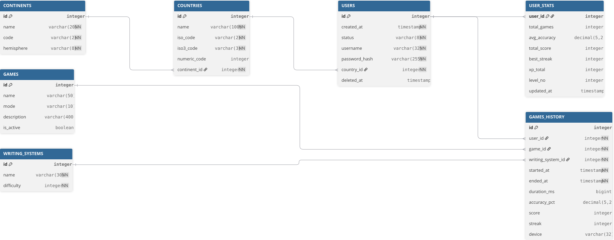

<div align='center'>
    
    <h1>Moji DB</h1>
</div>

**Moji** is an application for learning Japanese writing systems. This project contains the database structure (Oracle SQL) and scripts for managing it.

The database stores user progress (time, accuracy, streak, score) in recognition games, allowing for detailed reports on performance and exercise efficiency.

## 🚀 Getting Started

### Prerequisites
- **Docker** installed on your machine.
- **Python 3.9+** (optional, for running tests locally).

### Installation & Setup

The project uses a `Makefile` to automate all tasks.

1.  **Full Setup (Recommended)**
    This command starts the DB container, cleans existing data, creates tables, loads fixtures, initializes procedures, and runs the app.
    ```bash
    make all
    ```

2.  **Individual Steps**
    *   **Start Database**: `make install-db`
    *   **Create Schema & Load Data**: `make setup-db`
    *   **Load Stored Procedures**: `make init-procedures`
    *   **Run Application**: `make run-app`
    *   **Run Tests**: `make test`
    *   **Clean Database**: `make clean`

## 📂 Database Schema



The database consists of the following tables:

| Table | Description |
| :--- | :--- |
| **CONTINENTS** | Geographic continents data. |
| **COUNTRIES** | Countries linked to continents. |
| **WRITING_SYSTEMS** | Japanese writing systems (Hiragana, Katakana, Kanji, etc.). |
| **GAMES** | Available game modes and descriptions. |
| **USERS** | User accounts and authentication data. |
| **GAMES_HISTORY** | Records of played games, including score, accuracy, and duration. |
| **USER_STATS** | Aggregated statistics for each user (total score, level, etc.). |

## 📂 Project Structure

```
.
├── app/                # Streamlit Application
│   ├── src/            # Python Source Code (gui.py, database.py)
│   └── Dockerfile      # App Container Configuration
├── db/                 # Database SQL Files
│   ├── tables/         # Table definitions (DDL)
│   ├── fixtures/       # Initial data & Generators (DML)
│   ├── procedures/     # Stored Procedures (Reports)
│   └── triggers/       # Database Triggers
├── scripts/            # Automation Scripts
│   ├── app/            # App management scripts
│   └── db/             # Database management scripts
├── tests/              # Python Tests (pytest)
└── Makefile            # Task Runner
```

## 🛠 Scripts Reference

| Script | Description |
| :--- | :--- |
| `scripts/db/install-oracle-container.sh` | Starts the Oracle XE container (checks if exists). |
| `scripts/db/tables/create.sh` | Creates all tables from `db/tables/` in dependency order. |
| `scripts/db/tables/drop.sh` | Drops all project tables. |
| `scripts/db/fixtures/load.sh` | Loads data from `db/fixtures/`. |
| `scripts/db/procedures/load.sh` | Compiles stored procedures from `db/procedures/`. |
| `scripts/app/run.sh` | Builds and runs the Streamlit app container. |

