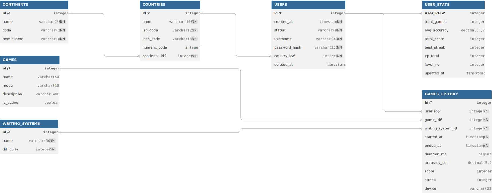
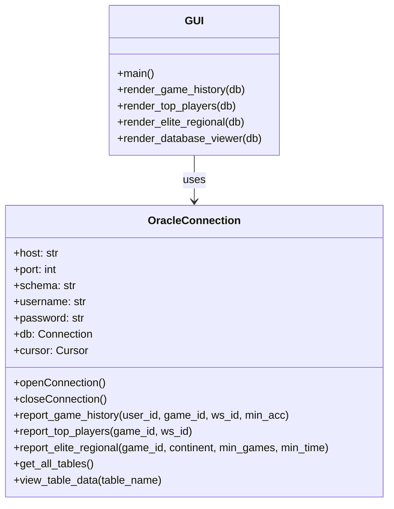
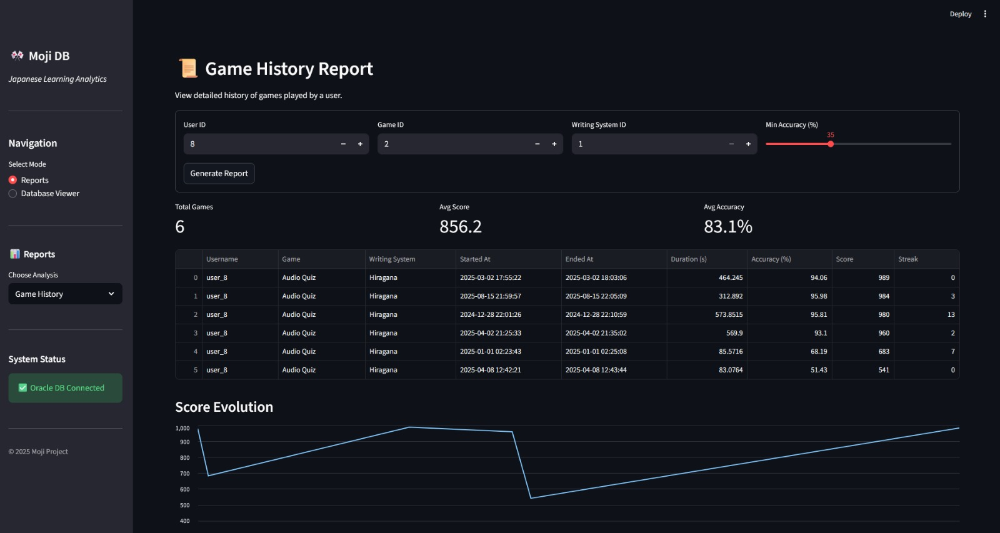
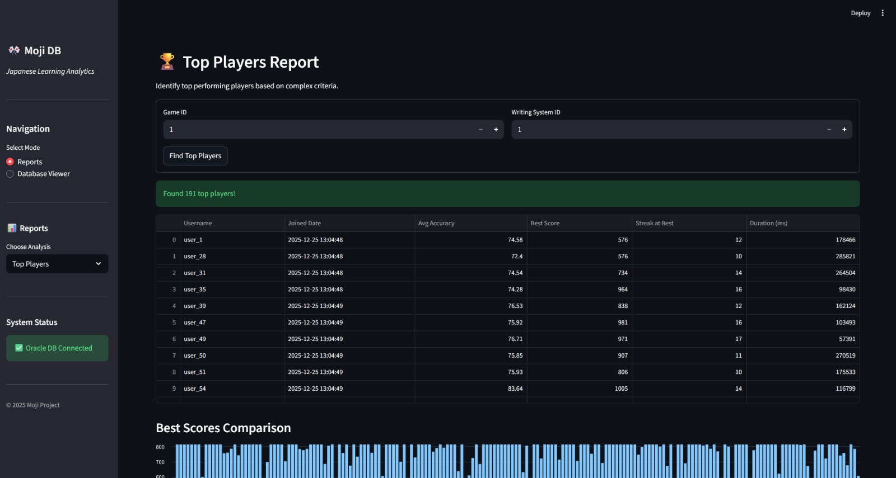
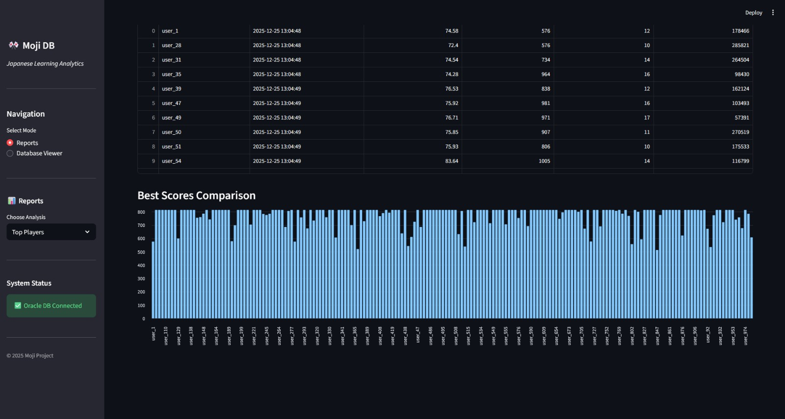
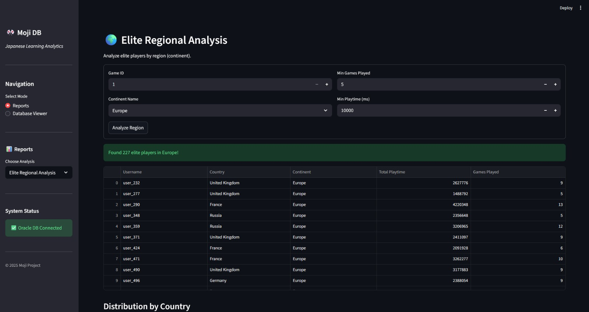
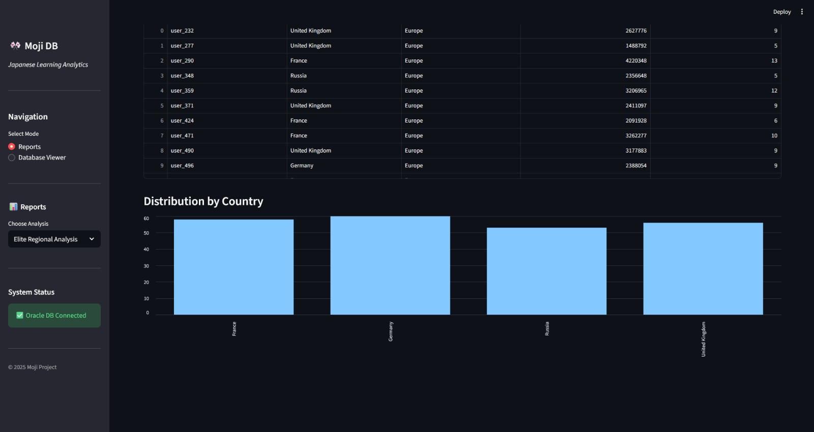

# Documentație Proiect Baze de Date - Moji DB

**Student:** Andrei-Iulian Ghita
**Grupa:** 344C3
**Anul:** 2025-2026

## 1. Descrierea Temei

**Moji** este o aplicație educațională dedicată învățării sistemelor de scriere japoneze (Hiragana, Katakana, Kanji). Aplicația oferă utilizatorilor o platformă interactivă prin care își pot exersa cunoștințele prin diverse mini-jocuri (citire, ascultare, scriere).

Scopul principal al bazei de date **Moji DB** este de a stoca și gestiona:
1.  **Utilizatorii și profilurile acestora** (inclusiv țara de origine și statisticile agregate).
2.  **Conținutul educațional** (sisteme de scriere, tipuri de jocuri).
3.  **Istoricul detaliat al activității** (fiecare sesiune de joc este înregistrată cu metrici precise: timp, acuratețe, scor, streak).

Această structură permite generarea de rapoarte complexe privind performanța utilizatorilor, identificarea celor mai dificile sisteme de scriere și analiza angajamentului pe regiuni geografice.

## 2. Descrierea Bazei de Date

Sistemul de Gestiune a Bazei de Date (SGBD) ales este **Oracle SQL**. Baza de date este proiectată în formă normală, utilizând constrângeri pentru a asigura integritatea datelor.

### 2.1. Diagrama Bazei de Date (ERD) - [dbdiagram.io](https://dbdiagram.io/)

*Relații principale:*
*   `USERS` -> `COUNTRIES` -> `CONTINENTS`
*   `GAMES_HISTORY` -> `USERS`, `GAMES`, `WRITING_SYSTEMS`
*   `USER_STATS` -> `USERS` (relație 1:1)

### 2.2. Structura Tabelelor

Proiectul conține **7 tabele** principale:

1.  **CONTINENTS**: Stochează continentele pentru normalizarea geografică.
    *   Coloane: `id` (PK), `name`, `code`, `hemisphere`.
2.  **COUNTRIES**: Lista țărilor, legată de continente.
    *   Coloane: `id` (PK), `name`, `iso_code`, `continent_id` (FK).
3.  **WRITING_SYSTEMS**: Tipurile de scriere (ex: Hiragana).
    *   Coloane: `id` (PK), `name`, `difficulty`.
4.  **GAMES**: Tipurile de jocuri disponibile.
    *   Coloane: `id` (PK), `name`, `mode`, `description`.
5.  **USERS**: Conturile utilizatorilor.
    *   Coloane: `id` (PK), `username`, `password_hash`, `country_id` (FK), `created_at`.
6.  **GAMES_HISTORY**: Tabelul central de fapte, înregistrează fiecare sesiune.
    *   Coloane: `id` (PK), `user_id` (FK), `game_id` (FK), `writing_system_id` (FK), `started_at`, `ended_at`, `score`, `accuracy_pct`, `streak`.
    *   Coloană virtuală: `duration_ms` (calculată automat din timestamp-uri).
7.  **USER_STATS**: Tabel de agregare pentru performanță rapidă.
    *   Coloane: `user_id` (PK, FK), `total_games`, `avg_accuracy`, `total_score`, `level_no`.

### 2.3. Descrierea Constrângerilor de Integritate

*   **Primary Keys (PK)**: Definite pe toate tabelele pentru identificare unică (ex: `USERS.id`).
*   **Foreign Keys (FK)**: Asigură integritatea referențială (ex: un utilizator nu poate exista fără o țară validă). `ON DELETE CASCADE` este folosit la istoric pentru a permite ștergerea ușoară a utilizatorilor.
*   **Check Constraints**:
    *   `accuracy_pct`: Între 0 și 100.
    *   `status`: Doar valorile 'active', 'banned', 'deleted'.
    *   `check_dates`: `ended_at` trebuie să fie >= `started_at`.
*   **Unique Constraints**: Pe `username`, `iso_code` pentru a preveni duplicatele.

### 2.4. Descrierea Procedurilor și Funcțiilor

Logica de business complexă este încapsulată în proceduri stocate PL/SQL, asigurând performanță și securitate.

**Proceduri Stocate (Rapoarte):**

1.  **`report_game_history`** (Complexitate 4+):
    *   **Scop**: Oferă un istoric detaliat al sesiunilor de joc pentru un utilizator.
    *   **Parametri**: `p_user_id`, `p_game_id`, `p_ws_id`, `p_min_accuracy`.
    *   **Logică**: Realizează `JOIN` între tabelele `GAMES_HISTORY`, `GAMES`, `WRITING_SYSTEMS` și `USERS`. Filtrează rezultatele dinamic și calculează durata sesiunii.

2.  **`report_top_players`** (Complexitate 6+):
    *   **Scop**: Identifică jucătorii de top pe baza performanței relative.
    *   **Parametri**: `p_game_id`, `p_ws_id`.
    *   **Logică**: Utilizează funcții analitice (`ROW_NUMBER`) pentru a clasifica jucătorii. Include subinterogări pentru a calcula media globală a timpului de joc și selectează doar utilizatorii care au depășit această medie cu o acuratețe ridicată.

3.  **`report_elite_regional`** (Complexitate 7+):
    *   **Scop**: Analiză avansată a jucătorilor "de elită" dintr-o anumită regiune geografică.
    *   **Parametri**: `p_game_id`, `p_continent_name`, `p_min_games`, `p_min_playtime`.
    *   **Logică**:
        *   Agregare complexă (`GROUP BY`) pe ultimele 12 luni.
        *   Diviziune relațională (simulată prin `MINUS` și `NOT EXISTS`) pentru a găsi jucătorii care au încercat **toate** jocurile disponibile.
        *   Verificare existențială (`EXISTS`) pentru a confirma dacă au jucat cel mai dificil sistem de scriere.

**Triggere:**

1.  **`trg_update_user_stats`**:
    *   **Tip**: `AFTER INSERT` pe `GAMES_HISTORY`.
    *   **Logică**: Menține automat tabelul de agregare `USER_STATS`. La fiecare joc nou, incrementează numărul total de jocuri, recalculează media mobilă a acurateței și actualizează scorul total și nivelul utilizatorului.

2.  **`trg_users_soft_delete`**:
    *   **Tip**: `BEFORE UPDATE` pe `USERS`.
    *   **Logică**: Setează automat câmpul `deleted_at` la timestamp-ul curent atunci când statusul unui utilizator devine 'deleted', implementând ștergerea logică.

3.  **`trg_user_stats_timestamp`**:
    *   **Tip**: `BEFORE UPDATE` pe `USER_STATS`.
    *   **Logică**: Actualizează automat coloana `updated_at` la fiecare modificare a statisticilor.

## 3. Descrierea Aplicației

Aplicația este dezvoltată în **Python** și servește drept interfață pentru vizualizarea datelor din Oracle.

### 3.1. Arhitectura Aplicației
Aplicația este construită folosind limbajul **Python** și framework-ul **Streamlit** pentru interfața grafică. Arhitectura urmează un model simplificat MVC (Model-View-Controller), unde:
*   **Model**: Baza de date Oracle și procedurile stocate.
*   **Controller**: Clasa `OracleConnection` din `database.py` care gestionează logica de acces la date.
*   **View**: Funcțiile de randare din `gui.py` care afișează datele utilizatorului.

### 3.2. Diagrama de Clase
Deși Python nu impune o structură strictă de clase, aplicația este organizată modular:

### 3.3. Structura Claselor
*   **`OracleConnection`**: Această clasă încapsulează toate interacțiunile cu baza de date.
    *   Gestionează ciclul de viață al conexiunii (deschidere/închidere).
    *   Expune metode specifice pentru fiecare raport (ex: `report_game_history`), care apelează procedurile stocate PL/SQL corespunzătoare.
    *   Transformă rezultatele brute (cursori Oracle) în structuri de date Python (liste/tupluri) ușor de consumat de interfață.

### 3.4. Diagrama de Stări și Fluxul de Lucru
Fluxul tipic de utilizare al aplicației:

1.  **Inițializare**: Aplicația pornește, citește configurările și instanțiază `OracleConnection`.
2.  **Conectare**: Se stabilește conexiunea la Oracle XE.
3.  **Navigare**: Utilizatorul selectează un raport din meniul lateral.
4.  **Input Parametri**: Utilizatorul completează formularul specific raportului (ex: ID utilizator, acuratețe minimă).
5.  **Procesare**:
    *   Aplicația apelează metoda din `OracleConnection`.
    *   `OracleConnection` execută procedura stocată.
    *   Baza de date returnează un `SYS_REFCURSOR`.
6.  **Vizualizare**: Datele sunt convertite într-un `pandas.DataFrame` și afișate sub formă de tabel și grafice.

### 3.5. Conexiunea cu Baza de Date
Conexiunea se realizează folosind biblioteca `cx_Oracle` (sau `oracledb`).
*   **Driver**: Oracle Instant Client (inclus în imaginea Docker).
*   **DSN (Data Source Name)**: Construit din host, port și service name (`XEPDB1`).
*   **Securitate**: Credențialele sunt preluate din variabile de mediu sau fișiere de configurare, nu sunt hardcodate în codul sursă final.
*   **Optimizare**: Conexiunea este cache-uită de Streamlit (`@st.cache_resource`) pentru a evita reconectarea la fiecare reîncărcare a paginii.

## 4. Capturi de Ecran

### Raport 1: Istoric Jocuri (Tabelar)

### Raport 2: Top Jucători (Grafic)

### Raport 3: Analiza Regională

## 5. Concluzii

Proiectul **Moji DB** demonstrează o arhitectură robustă pentru o aplicație de e-learning. Utilizarea procedurilor stocate pentru logica de business (rapoarte) și a triggerelor pentru menținerea statisticilor în timp real asigură performanță și integritate, decuplând logica bazei de date de stratul aplicației. Structura normalizată permite extinderea ușoară (adăugarea de noi jocuri sau limbi) fără modificări majore de schemă.

## 6. Bibliografie

1.  Oracle Database SQL Language Reference.
2.  Documentația cursului Baze de Date (2025).
3.  Python `oracledb` Documentation.
